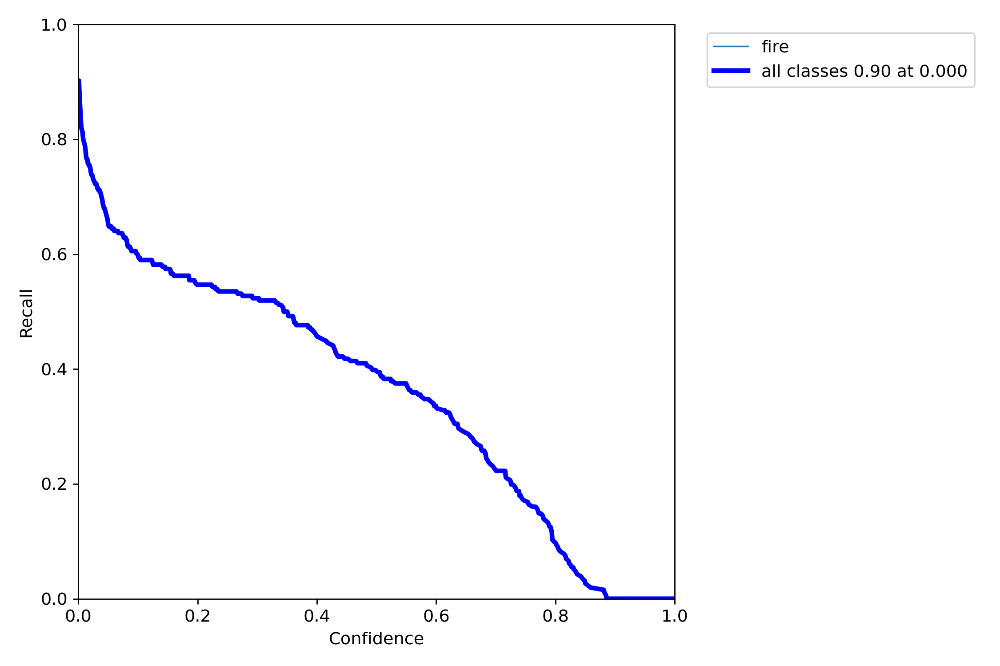
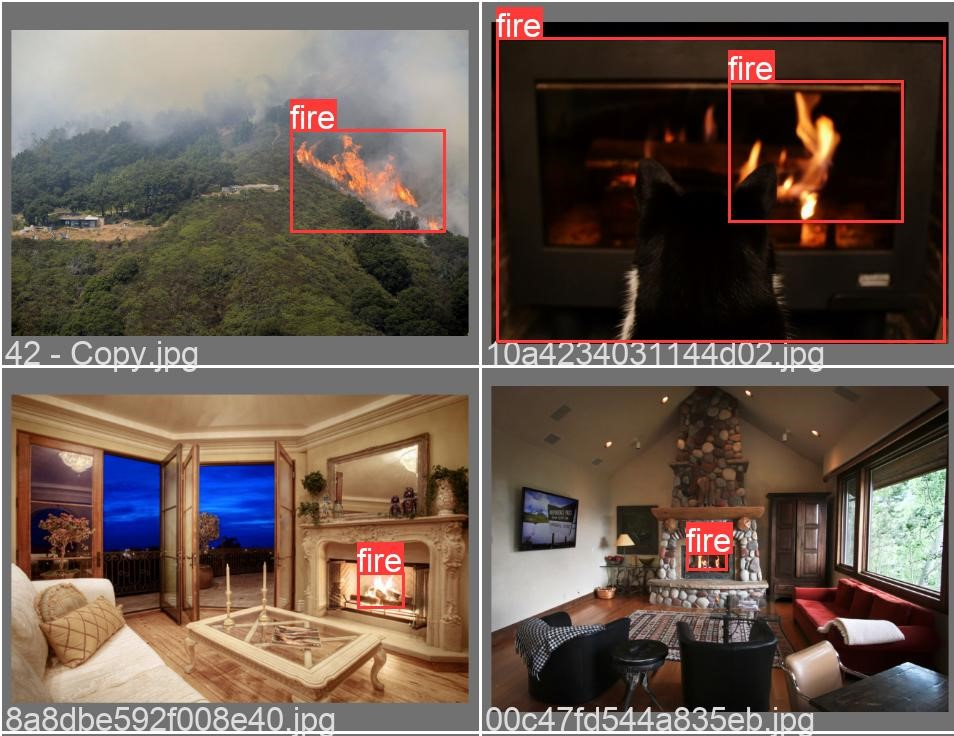

# Yolov5 for Fire Detection
This project presents the development and implementation of an advanced Smart Water Sprinkler System designed for fire detection and extinguishing. Using and integrating artificial intelligence (AI), robotics, and high-pressure sprinkler technology, the system aims to address critical limitations in current firefighting methodologies. The AI component employs a model trained on a diverse dataset to detect fires accurately, while a precision-focused robotic arm precisely points to the source after getting the location of the fire. The high-pressure sprinkler system ensures rapid and efficient extinguishing.


## Table of Contents
1. [Introduction](#introduction)
2. [System Overview](#system-overview)
3. [Our Approach](#our-approach)
   - [System Design](#system-design)
   - [Software Design](#software-design)
   - [Mechanical Design](#mechanical-design)
   - [Electrical Design](#electrical-design)
4. [Risk Assessment](#risk-assessment)
5. [Testing and Implementation](#testing-and-implementation)
   - [Components and Costs](#components-and-costs)
6. [Conclusion](#conclusion)

## Introduction

This project aims to create a Smart Water Sprinkler System capable of detecting and extinguishing fires using a combination of AI, robotics, and high-pressure water sprinklers. By leveraging advanced technologies, this system provides a more efficient and effective solution to fire detection and suppression, potentially reducing property damage and saving lives.

## System Overview

The Smart Water Sprinkler System consists of four main components:
1. **Fire Detection and Localization Module**: Utilizes a Raspberry Pi and a camera module running YOLOv5 for real-time fire detection and localization.
2. **Robotic Arm**: A 2 DOF arm equipped with servo motors for precise targeting of the fire source.
3. **NodeMCU32-S**: Controls the motor movements and handles remote operations.
4. **High-Pressure Water Sprinkler**: Ensures rapid extinguishing of detected fires.

The system is designed to operate in both manual and automatic modes, with IoT integration for seamless switching.

## Our Approach

### System Design

The system continuously monitors the environment using a Raspberry Pi camera mounted on a servo motor. The camera sweeps the area in 5-degree increments to detect fires. A thermal imager validates the presence of fire. Upon detection, the system calculates the precise location of the fire using image coordinates and directs the robotic arm accordingly. For testing, the system is enclosed in an 80x80x40 cm space, simulating a room.

### Software Design

The software component involves two main models:
1. **YOLOv5**: Trained to detect fires and provide bounding box coordinates. It is optimized for real-time performance on a Raspberry Pi.
2. **Random Forest Model**: Aggregates sensor data to confirm the presence of a real fire, reducing false positives.

### Mechanical Design

The robotic arm has 2 DOF, with one joint for horizontal movement and another for vertical movement. It uses MG995 servo motors for precise positioning. The arm is equipped with a water hose connected to a high-pressure pump for fire suppression.

### Electrical Design

The electrical system includes a Raspberry Pi connected to a PI Camera and NodeMCU32-S. The NodeMCU32-S controls the servo motors, thermal imager, and smoke sensor. The system uses a computer power supply for powering all components and a relay for controlling the water pump.

## Risk Assessment

Identified risks and their mitigation strategies are outlined in the table below:

| Risks                           | Description                                       | Likelihood | Impact  | Mitigation Strategy                                          |
|---------------------------------|---------------------------------------------------|------------|---------|--------------------------------------------------------------|
| R1: Fire detection system failure | Failure to detect fire                           | Moderate   | High    | Regular testing, backup sensors                              |
| R2: Robotic arm malfunction      | Arm fails to operate correctly                    | Low        | Moderate| Regular inspection, emergency manual control                 |
| R3: Water pump failure           | Pump fails to operate                             | Low        | High    | Regular maintenance, backup pump                             |
| R4: Electrical system failure    | Electrical components fail                        | Moderate   | High    | Surge protection, backup power supply                        |
| R5: False positive fire detection| Incorrect fire detection                          | Moderate   | Moderate| Verification system, additional sensors                      |
| R6: Inadequate water supply      | Insufficient water for extinguishing              | Low        | High    | Regular monitoring, low water level alarms                   |
| R7: Integration issues           | Software and hardware integration issues          | Moderate   | Moderate| Thorough testing, regular updates                            |
| R8: Inaccurate positioning       | Robotic arm misalignment                          | Moderate   | Moderate| Feedback mechanisms, regular calibration                     |
| R9: Safety risks                 | High-pressure water hazards                       | Low        | High    | Safety mechanisms, user training                             |

## Testing and Implementation

### Components and Costs

A detailed list of components and their costs is provided below:

| Component             | Part Number                      | Link                                                                                  | Price  |
|-----------------------|----------------------------------|---------------------------------------------------------------------------------------|--------|
| Smoke Detector        | MQ-2 Smoke Gas Sensor            | [MQ-2 Smoke Gas Sensor](https://electroslab.com/products/mq-2-smoke-gas-sensor-module) | $3.00  |
| Camera                | Raspberry Pi B/B+ Official Camera| [Raspberry Pi Camera](https://katranji.com/en/item/357715)                             | $5.50  |
| Robotic Arm           | 2DOF Robot Arm with 3 MG995 Motors | [Robot Arm](https://electroslab.com/products/not-assembly-full-set-diy-2dof-robot-arm) | $55.00 |
| Casing                | Plexi Glass                      | N/A                                                                                   | $100.00|
| Raspberry Pi          | Raspberry Pi 3 Model B+          | [Raspberry Pi 3 B+](https://katranji.com/en/item/426756)                              | $55.00 |
| Water Pump            | 12V Fuel/Water Pump              | [Water Pump](https://katranji.com/en/item/478937)                                     | $25.00 |
| Arduino Relay         | Relay 5V 10A                     | [Relay](https://katranji.com/en/item/365048)                                          | $0.60  |
| Power Supply          | Computer Power Supply 12V,5V,3.3V| [Power Supply](https://katranji.com/en/item/335049)                                   | $10.00 |
| NodeMCU-32s           | NodeMCU-32S                      | [NodeMCU-32S](https://www.ubuy.com.lb/en/productcn/IEN3XPJLC-nodemcu-esp-32s-esp-wroom-32e-wifi-development-board-service-port-wifi-bluetooth-module) | $7.00  |

For more information on parts and components, see Appendix C.

## Conclusion

The Smart Water Sprinkler System represents a significant advancement in fire detection and suppression technology. By integrating AI, robotics, and IoT capabilities, this system offers a reliable and efficient solution for enhancing fire safety in various settings. Continued testing and development will ensure the system meets all safety and performance standards.


<hr>
<hr>
<hr>
<hr>
<hr>

<h2 align="center">Credits to spacewalk01 for the fire detection model</h2>
<p align="center">
  
</p>

#### Install
Clone this repo and use the following script to install [YOLOv5](https://github.com/ultralytics/yolov5). 
```
# Clone
git clone https://github.com/spacewalk01/Yolov5-Fire-Detection
cd Yolov5-Fire-Detection

# Install yolov5
git clone https://github.com/ultralytics/yolov5
cd yolov5
pip install -r requirements.txt
```


#### Training
I set up ```train.ipynb``` script for training the model from scratch. To train the model, download [Fire-Dataset](https://drive.google.com/file/d/1TQKA9nzo0BVwtmojmSusDt5j02KWzIu9/view?usp=sharing) and put it in ```datasets``` folder. This dataset contains samples from both [Fire & Smoke](https://www.kaggle.com/dataclusterlabs/fire-and-smoke-dataset) and [Fire & Guns](https://www.kaggle.com/atulyakumar98/fire-and-gun-dataset) datasets on Kaggle. I filtered out images and annotations that contain smokes & guns as well as images with low resolution, and then changed fire annotation's label in annotation files.
```
python train.py --img 640 --batch 16 --epochs 10 --data ../fire_config.yaml --weights yolov5s.pt --workers 0
```
#### Prediction
If you train your own model, use the following command for detection:
```
python detect.py --source ../input.mp4 --weights runs/train/exp/weights/best.pt --conf 0.2
```
Or you can use the pretrained model located in ```models``` folder for detection as follows:
```
python detect.py --source ../input.mp4 --weights ../models/best.pt --conf 0.2
```

## Results
The following charts were produced after training YOLOv5s with input size 640x640 on the fire dataset for 10 epochs.

| P Curve | PR Curve | R Curve |
| :-: | :-: | :-: |
|  |  |  |

#### Prediction Results
The fire detection results were fairly good even though the model was trained only for a few epochs. However, I observed that the trained model tends to predict red emergency light on top of police car as fire. It might be due to the fact that the training dataset contains only a few hundreds of negative samples. We may fix such problem and further improve the performance of the model by adding images with non-labeled fire objects as negative samples. The [authors](https://github.com/ultralytics/yolov5/wiki/Tips-for-Best-Training-Results) who created YOLOv5 recommend using about 0-10% background images to help reduce false positives. 

| Ground Truth | Prediction | 
| :-: | :-: |
|  |  |
|  |  | 

#### Feature Visualization
It is desirable for AI engineers to know what happens under the hood of object detection models. Visualizing features in deep learning models can help us a little bit understand how they make predictions. In YOLOv5, we can visualize features using ```--visualize``` argument as follows:

```
python detect.py --weights runs/train/exp/weights/best.pt --img 640 --conf 0.2 --source ../datasets/fire/val/images/0.jpg --visualize
```

| Input | Feature Maps | 
| :-: | :-: |
|  |  |

## Reference
I borrowed and modified [YOLOv5-Custom-Training.ipynb](https://github.com/ultralytics/yolov5/wiki/Train-Custom-Data) script for training YOLOv5 model on the fire dataset. For more information on training YOLOv5, please refer to its homepage.
* https://github.com/robmarkcole/fire-detection-from-images
* https://github.com/ultralytics/yolov5
* https://github.com/AlexeyAB/darknet
